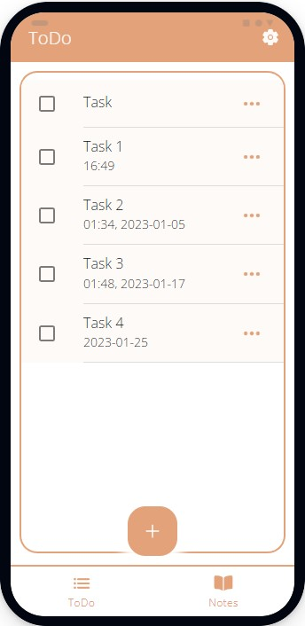
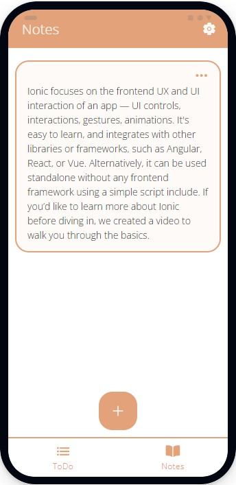
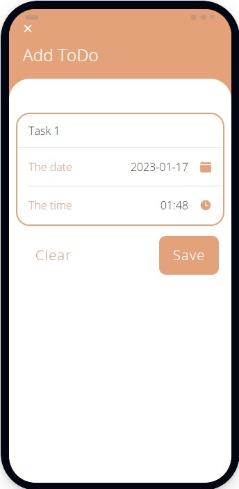
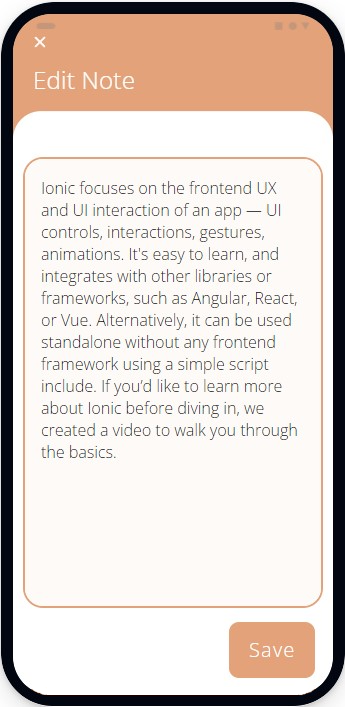
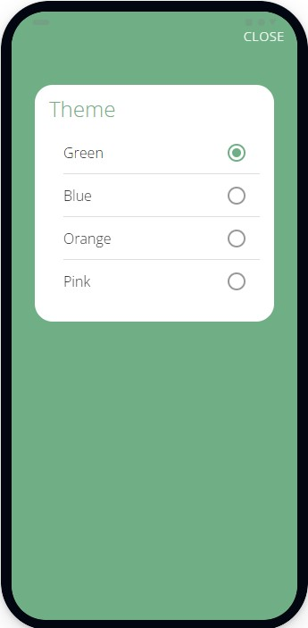
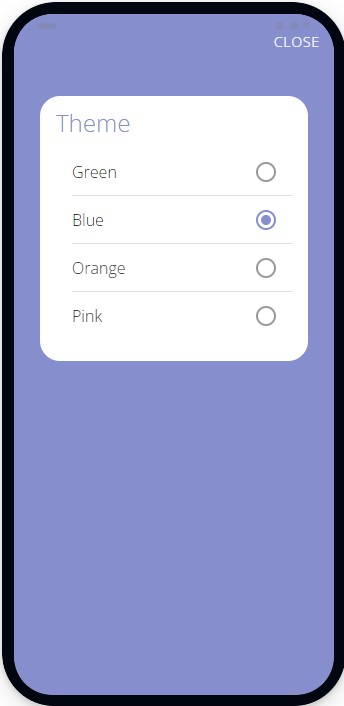
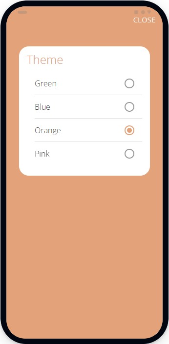
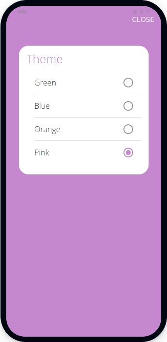

<!-- PROJECT LOGO -->
 

  
  <h3 align="center">DoDo</h3>

  

    Task Manager
  

  

    <a href="https://irasoro.github.io/DoDo/">View Demo</a>
  
  

<!-- ABOUT THE PROJECT -->
### About The Project

DoDo - basic mobile application to plan and manage personal daily tasks. Scheduler made using with Ionic and React. Application offers features such as creating and editing simple notes and ToDo list.

The DoDo application is built for Android, the .apk file is attached to the project.

### Built With
* [Ionic](https://ionicframework.com/)
* [React](https://reactjs.org/)
* [Ionic Storage](https://github.com/ionic-team/ionic-storage)

<!-- USAGE EXAMPLES -->
### Usage

<table>
  <tr>
    <td></td>
    <td></td>
    <td></td>
    <td></td>
  </tr>
  <tr>
    <td align="center">ToDo Tab</td>
    <td align="center">Notes Tab</td>
    <td align="center">Add Task</td>
    <td align="center">Edit Note</td>
  </tr> 
    <tr>
    <td></td>
    <td></td>
    <td></td>
    <td></td>
  </tr>
  <tr>
    <td align="center">Green Theme</td>
    <td align="center">Blue Theme</td>
    <td align="center">Orange Theme</td>
    <td align="center">Pink Theme</td>
  </tr> 
 </table>

 <!-- ICON -->
### Icon
From https://www.svgrepo.com/svg/17398/notebook
