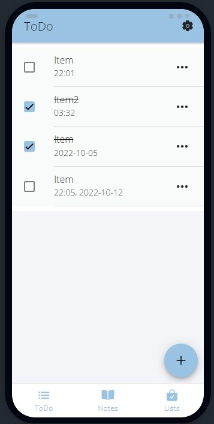
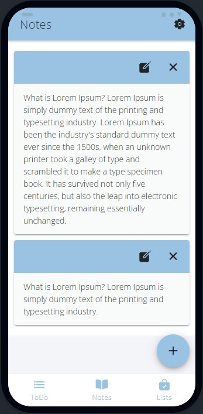
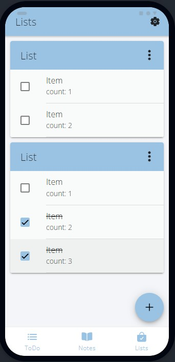
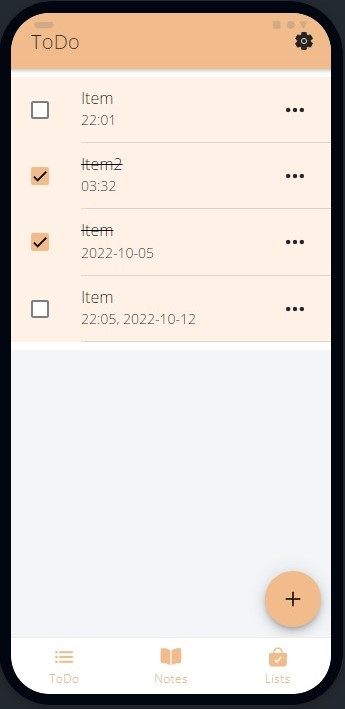
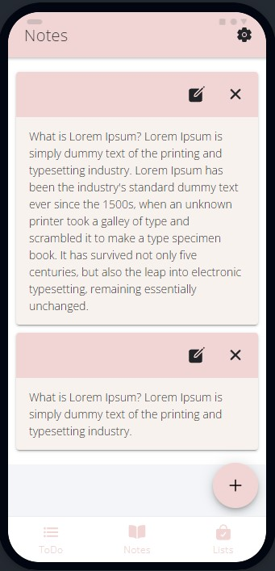
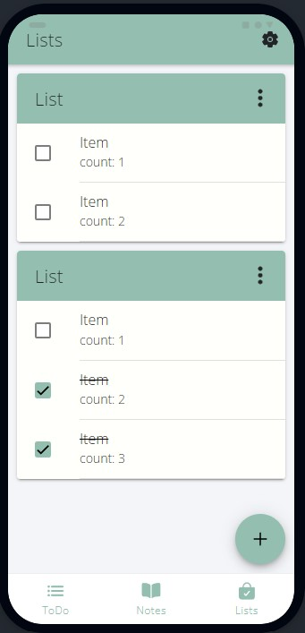

# Scheduler app
## About
Scheduler - basic mobile application to plan and manage personal daily tasks. Scheduler made using with Ionic and React.
Application offers features such as creating and editing
* simple notes,
* ToDo list
* and other listings.

The Scheduler application is built for Android, the .apk file is attached to the project.

<h2> Workspace screenshots </h2>

  
  
  
  

<h2> Other themes screenshots</h2>

  
  
  

